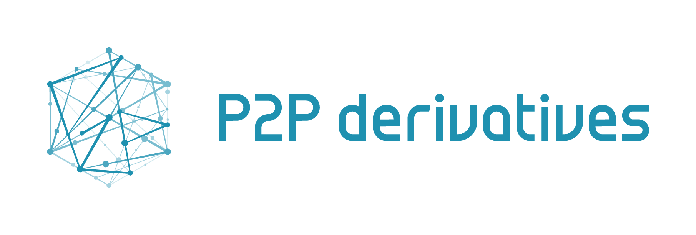

# P2PDerivatives



P2PDerivatives is an application that enables users to enter into Discreet Log Contracts with each others.

Features include:

- Offering a contract to a peer
- Accepting or rejecting a contract
- Automatic contract settlement at maturity

The application is in a very beta stage, _DO NOT TRY TO USE IT ON MAINNET_.

## Usage

Before using the application, make sure to read the [terms and conditions](./docs/Legal.md).

The application currently uses a server to enable communication between peers, as well as an oracle server to provide with information on trading price and signatures.
To make it easier for people to test it, we made instances of these servers available for anybody to use.
If you prefer, you can run the servers yourself.
You will also need to connect the application to a running bitcoind instance.

### Through CryptoGarage server

Download the latest release of the application [here](https://github.com/p2pderivatives/p2pderivatives-client/releases).

### Running your own servers

For testing locally, you can use the docker images available in this repository.  
The docker images are made available through github packages , which requires authentication to pull any image (even for public repository). You will thus need to log in first with your github account or use an authentication token to pull those images:
```
docker login https://docker.pkg.github.com -u USERNAME --password-stdin
```   
Simply run:

```
docker-compose up
```

This will also spin a bitcoind instance on regtest.
If you wish to use your own bitcoind instance, you can run:

```
docker-compose server server-db oracle oracle-db
```

Otherwise you can visit the repositories for [the communication server](https://github.com/p2pderivatives/p2pderivatives-server) and [the oracle server](https://github.com/p2pderivatives/p2pderivatives-oracle).

You can then update the `./setting.production.yml` file with the parameters fitting your configuration and run `npm run dist`.

If you just want to quickly try it out, you can also just modify the `settings.default.yml` file and run `npm run electron-dev` (you can run a second instance of the application using `npm run electron-dev-simple`).

### Setting up bitcoind

You can download bitcoin core software [here](https://bitcoin.org/en/download).
There are also other ways to install or download it depending on your operating system, which can be found easily on any search engine.

Once bitcoin-core is installed, you can use the scripts on this repository to start a node and create some wallets for testing.

(Note that these are bash scripts and will thus not work on a windows shell.
If using windows, you might be able to use them with git bash, but this is currently untested.)

Start by creating a folder somewhere on your computer and call it `p2pderivatives` (or whatever you prefer), and a sub-folder `scripts`.
Copy the content of the `./scripts` folder on this repository to the `scripts` folder you just created.

#### Regtest

An easy way to test the application is to run a node in regtest.
`cd` into the `scripts` folder you created, and run `./start_bitcoind.sh`.

#### Testnet

To start a bitcoind instance on testnet, `cd` into the `scripts` folder you created and run `BITCOIN_NET=testnet ./start_bitcoind.sh`.

#### Creating a wallet

You can either use the main wallet of bitcoind, or create a separate wallet (which is handy if you want to play around with two users on the same computer).
To create a wallet, you can use the `createwallet` command of the `bitcoin-cli`.
For example, from within the scripts folder:

```
bitcoin-cli -datadir=./bitcoind -conf="bitcoin.regtest.conf" createwallet "alice" "false" "false" "str0nGP@ssw9rd"
```

#### Generate blocks in regtest

For the contract to be settled, you will have to generate blocks on regtest.
You can do so with the following command (assuming that you have created a wallet named `alice` previously):

```
bitcoin-cli -datadir=./bitcoind -conf=bitcoin.regtest.conf generatetoaddress 9 $(bitcoin-cli -datadir=./bitcoind -conf=bitcoin.regtest.conf -rpcwallet=alice getnewaddress)
```

Replace the number `9` with the number of block you wish to generate.

## Contributing

Contributions are welcome.
Have a look at the [contributing guidelines](./docs/Contributing.md) and [development document](./docs/Development.md) if you have interest.

## Known limitations

- The application uses the `lockunspent` rpc call of the bitcoind wallet to make sure that UTXOs are not reused across offered contracts. However, [as stated in the documentation](https://bitcoincore.org/en/doc/0.20.0/rpc/wallet/lockunspent/), the bitcoind wallet only keeps the locked transaction into memory. This means that if the wallet is restarted while a contract is in the offer state (the fund transaction is not broadcast yet), when creating a new contract, it is possible that the previously allocated UTXOs will be reused, making one of the contract invalid.
- It is currently not possible to abort a contract once it has been offered meaning UTXOs will be locked until the contract is accepted or rejected by the counter party.
- A lot of bugs are probably waiting to be found!
